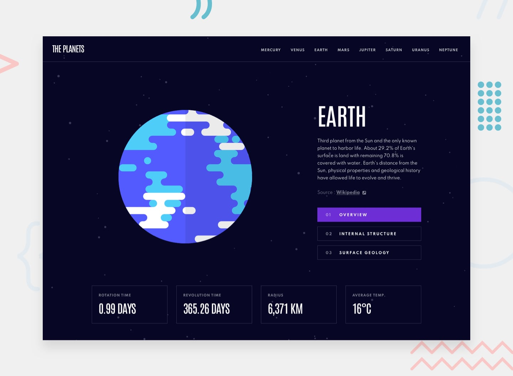

# 🌌 Solar System Planet Characteristics Websites
# Frontend Mentor - Planets fact site solution

This is a solution to the [Planets fact site challenge on Frontend Mentor](https://www.frontendmentor.io/challenges/planets-fact-site-gazqN8w_f). Frontend Mentor challenges help you improve your coding skills by building realistic projects. 

An interactive website containing detailed astronomical data on the eight planets of the Solar System. The project is designed for space enthusiasts and educational purposes.

## 🚀 Project Link
👉 [View the site live](https://sashayerokhov.github.io/Planet_Facts-site/)

## Overview

### The challenge

Users should be able to:

- View the optimal layout for the app depending on their device's screen size
- See hover states for all interactive elements on the page
- View each planet page and toggle between "Overview", "Internal Structure", and "Surface Geology"

### Screenshot

## ✨ Features
* 🪐 Detailed cards for each planet.
* ⏱️ Comparison of rotation times around the Sun and the planet's axis.
* 🌓 Information on the structure and geological characteristics of the planets, including a photo of the planet.
* 📱 Responsive design: the site is easy to view on both PCs and smartphones.

## 🛠️ Tech Stack
* **Frontend:** HTML5, CSS3 (Flexbox), JavaScript (ES6)
* **Data:** JSON file / data.json*
* **Deployment:** GitHub Pages 

## 📊 What data is used in the project
For each planet, the website displays:
* **Physical properties:** mass, equatorial radius, gravity.
* **Orbital properties:** rotation time, revolution time, radius and average temperature.
* **Atmosphere:** average temperature, gas composition.
## 👤 Author
* Sasha / SashaYerokhov — (https://github.com/SashaYerokhov)

**Note: Delete this note and edit this section's content as necessary. If you completed this challenge by yourself, feel free to delete this section entirely.**
